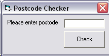



## Full UK Postcode Checker

### Description

tells you if a postcode you enter is a valid UK postcode. It includes all current criteria for a valid postcode including length, format and valid characters in each postition. see code for more info. Please note no other postcode checker on PSC currently checks the full criteria that this function/application does.
 
### More Info
 
Postcode passed as a string with a space seperating the outcode (first part of the postcode) and incode (second part of the postcode)

The function can be copied into your own application

True if it is valid, false if it is not

A message box will be displayed notifying you if it is valid or invalid

             |
---                |---
**Submitted On**   |2007-02-14 06:50:02
**By**             |[Barry Chocolate](https://github.com/Planet-Source-Code/PSCIndex/blob/master/ByAuthor/barry-chocolate.md)
**Level**          |Advanced
**User Rating**    |5.0 (20 globes from 4 users)
**Compatibility**  |VB 3\.0, VB 4\.0 \(16\-bit\), VB 4\.0 \(32\-bit\), VB 5\.0, VB 6\.0, VB Script, VBA MS Access, VBA MS Excel
**Category**       |[Miscellaneous](https://github.com/Planet-Source-Code/PSCIndex/blob/master/ByCategory/miscellaneous__1-1.md)
**World**          |[Visual Basic](https://github.com/Planet-Source-Code/PSCIndex/blob/master/ByWorld/visual-basic.md)
**Archive File**   |[Full\_UK\_Po2047852142007\.zip](https://github.com/Planet-Source-Code/barry-chocolate-full-uk-postcode-checker__1-67801/archive/master.zip)

